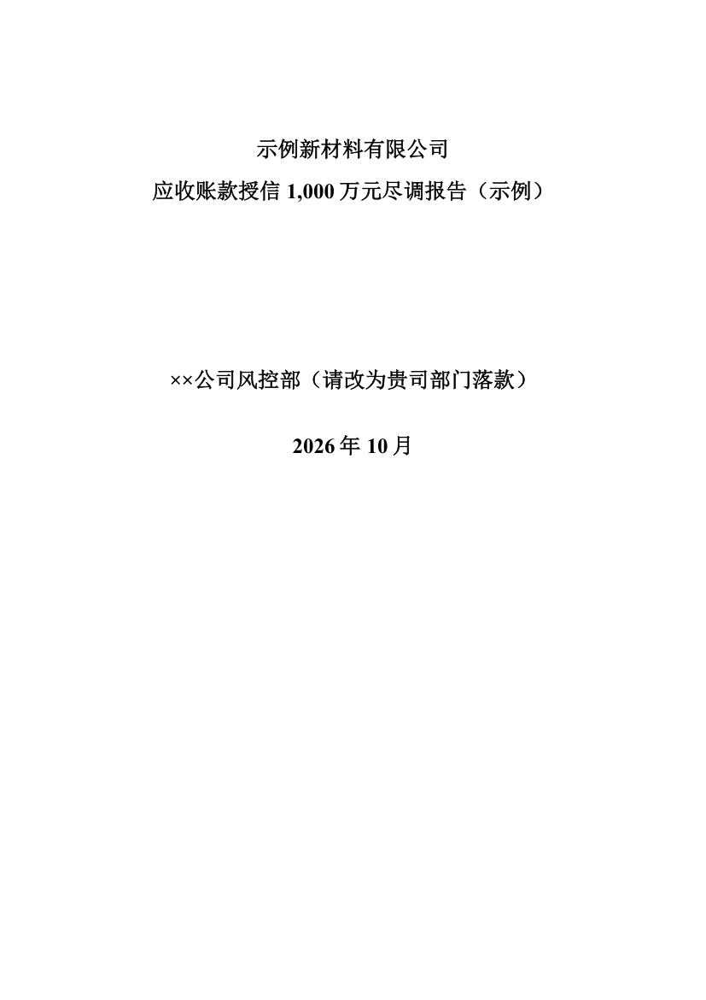
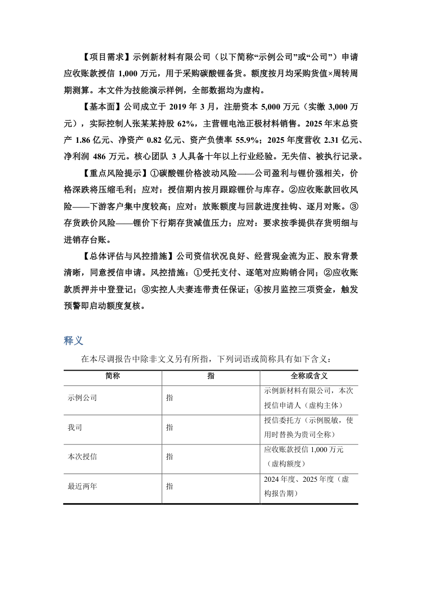

# AI 尽调报告生成系统（DD Report Kit）

> 风控授信尽调报告的 AI 全流程生产系统：**方法论 → 结构化内容 → 一键构建 Word 报告 → 11 项门禁 → 批注轮修订手术**。
> 源自一条真实业务线的风控授信尽调实践（2026 年累计十余轮迭代、69 条返工教训机制化），脱敏后开源。
> 设计为 Claude Code 的 Skill + Agent + SOP + 工具链组合，也可移植到任何支持 SKILL.md 约定的 AI Agent。

**给一份结构化内容（content.json），产出一本格式规范、勾稽可复算、门禁全绿的尽调报告 docx；给一份带批注的旧报告，用"手术原语"做可追溯的修订。**

---

## 效果预览

| 封面 | 意见区+三线表 |
|---|---|
|  |  |

以上两页由仓库内示例一键生成：`examples/content.example.json`（虚构公司、虚构数据），开箱可复现。

## 它解决什么问题

风控/授信尽调报告的 AI 生成有三个老大难，本系统分别给出了机制化答案：

| 难题 | 机制 |
|---|---|
| AI 写的格式永远对不上公司规范 | **格式母版法**：builder 从贵司定稿报告克隆 8 类格式样本（cover/h1/h2/br/p/note/unit/blank），清空正文重建，100% 继承字体/缩进/行距/三线表样式 |
| AI 编数字、算错数 | **零手敲 + 勾稽门禁**：派生数字一律脚本复算；selfcheck 11 项门禁 FAIL 不得交付（圈码字体/批注锚点/标点配对/表格结构/重复段/TOC污染/周转天数自洽…）；底稿标准件 calc_verify.py 让每个比率可独立复算 |
| 改稿轮（领导批注/手改）不敢让 AI 碰 Word | **手术原语库 docx_edit_lib**：修订模式下的 tracked_replace / tracked_insert_para_after / tracked_insert_row_after / bold_text_tracked，每步带唯一命中断言与改后自验；批注驱动修订闭环（dump→意图三问→手术→批注闭环→门禁→渲染目检） |

## 仓库结构

```
claude-dd-report/
├── skills/dd-report/SKILL.md      ← 核心技能 v6.15（约120KB 铁律库：全部由真实返工事故沉淀）
├── agents/dd-expert.md            ← 尽调统筹专家 Agent（企查查全域 MCP 编排）
├── workflows/DD-SOP-004           ← 全流程 SOP v2.0：七阶段驾驶视图（接单→底稿→初稿→门禁→批注轮→手改轮→外部意见）
├── tools/                         ← 16 个工具脚本（Python，开箱即用）
│   ├── dd_report_builder.py       ← content.json → docx（格式母版法）
│   ├── dd_report_selfcheck.py     ← 11 项交付门禁（FAIL 不得交付）
│   ├── dd_report_consistency.py   ← 表格勾稽一致性核对（基线差异法）
│   ├── docx_edit_lib.py           ← 修订手术原语库 v1.3
│   ├── dd_comment_closure.py      ← 批注 dump / 闭环
│   ├── dd_word_finalize.py        ← Word 定稿器（刷域/导PDF/体检）
│   ├── dd_ceo_edit_diff.py        ← 终审人手改回收（一条命令出手改清单）
│   └── …（提取/格式对齐/结构读取/比率表等）
├── templates/
│   ├── dd_report_master.docx      ← 脱敏格式母版（8类格式样本，可直接用/可定制）
│   ├── build_master.py            ← 母版再生成脚本（按贵司规范改字体字号）
│   ├── dd_report_structure.md     ← 七大章节标准骨架
│   └── dd_report_content_schema.md← content.json 块类型说明
├── examples/content.example.json  ← 虚构公司示例（一键跑通全链路）
├── docs/
│   ├── INSTALL.md                 ← 安装到 Claude Code / 其他 Agent
│   ├── MCP数据源配置.md            ← 企查查等数据源接入与降级路径
│   ├── preferences.example.yaml   ← 尽调偏好配置样例
│   └── frameworks/                ← 方法论四件套（顶层方法论/报表机制/解读模板/修订playbook）
└── LICENSE (MIT)
```

## 快速开始

```powershell
# 0) 依赖：Python 3.10+
pip install python-docx lxml
# 可选（Word 定稿器/渲染目检）：pywin32（Windows+已装Word）、PyMuPDF

# 1) 跑通示例：构建 → 门禁
python tools/dd_report_builder.py examples/content.example.json templates/dd_report_master.docx 我的报告.docx
python tools/dd_report_selfcheck.py 我的报告.docx

# 2) 装进 Claude Code：见 docs/INSTALL.md（skill + agent 两条路）
```

日常使用时，你只需对 Claude 说：**"给XX公司写一份尽调报告，授信类型XX、额度XX"**，或
丢给它一份**带批注的旧报告**说"按批注改"——SKILL.md 会驱动它走完七阶段流水线。

## 方法论内核（写在 SKILL.md 里的两条"最高铁律"）

1. **两大核心目的**：①了解这家公司的一切与所在行业；②在我方业务需求下，看清合作风险点、重点风险与风控措施。一切分析落到"能不能安全合作"。
2. **资信风险视角**：放账=垫资=借钱，首要风险是资信风险。从"**实力**（还得起吗）+ **资信**（愿意还吗、会不会变坏）"两个维度做多维核查，重大问题明确点出、不回避。

支撑机制：证据台账（写正文前建）、口径锁定（涉财务必做）、同业比较可比性优先、压力测试三档单调、意见区落点=风控决断、外部 AI 意见逐条核实协议、举一反三连带扫描。

## 数据源

- **企查查全域 MCP**（推荐）：工商/股东/实控人/35项风险扫描/知产/涉诉/法律——配置见 `docs/MCP数据源配置.md`
- 无商业数据授权时：国家企业信用公示系统 + 裁判文书网 + 交易所披露 + 委托方提供资料（征信/审计报表），SKILL 内置降级路径，信息缺口如实标注
- 财务接口：同花顺 iFind / akshare 等任选，关键数字必须可溯源

## 适用与免责

- 适用：供应链金融/贸易授信/银行对公场景的企业资信尽调报告生产与迭代修订
- 本仓库**不含任何真实客户数据**；示例报告全部为虚构主体与虚构数字
- 产出为辅助初稿与修订工具，最终授信决策须由人类风控人员把关

## License

MIT
